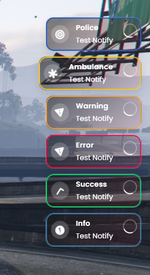

# 🔔 drm-notify [QB/QBOX/ESX Notification System]

A professional, easy-to-use, and highly customizable notification resource for FiveM, supporting QBCore, Qbx_Core and ESX frameworks.

**💬 Support Discord**: [Dream Scripting](https://discord.gg/nkMTBARzz4)  



---

## 🚀 Installation

### Resource Installation
1. Download or clone the repository to your `resources` folder.

2. Add the following line to your `server.cfg`:


```bash
ensure drm-notify
```

## Server Side Trigger
```lua
TriggerClientEvent('drm-notify:client:sendNotify', src, text, type, length)
```

## Client Side Trigger
```lua
exports['drm-notify']:notify(text, texttype, length)
```

---

## ⚙️ Framework Setup

### 🟢 QBCore

**Step 1:** Open the file:

```
qb-core/client/functions.lua
```

Locate the `QBCore.Functions.Notify` function 

```lua
function QBCore.Functions.Notify(text, texttype, length, icon)
    local message = {
        action = 'notify',
        type = texttype or 'primary',
        length = length or 5000,
    }

    if type(text) == 'table' then
        message.text = text.text or 'Placeholder'
        message.caption = text.caption or 'Placeholder'
    else
        message.text = text
    end

    if icon then
        message.icon = icon
    end

    SendNUIMessage(message)
end
```
- Replace it with
```lua
function QBCore.Functions.Notify(text, texttype, length)
    exports['drm-notify']:notify(text, texttype, length)
end
```

**Step 2:** Restart your server or type in your console (F8):

```bash
ensure drm-notify
```

### ✅ **QBCore Usage Example**:

```lua
QBCore.Functions.Notify("Your message here", "success", 5000)
```

---

### 🟢 QBxCore

**Step 1:** Open the file:

```
qbx_core/client/functions.lua
```

Locate the `function Notify` function 

```lua
function Notify(text, notifyType, duration, subTitle, notifyPosition, notifyStyle, notifyIcon, notifyIconColor)
    local title, description
    if type(text) == 'table' then
        title = text.text or 'Placeholder'
        description = text.caption or nil
    elseif subTitle then
        title = text
        description = subTitle
    else
        description = text
    end
    local position = notifyPosition or positionConfig

    lib.notify({
        id = title,
        title = title,
        description = description,
        duration = duration,
        type = notifyType,
        position = position,
        style = notifyStyle,
        icon = notifyIcon,
        iconColor = notifyIconColor
    })
end
```
- Replace it with
```lua
function Notify(text, notifyType, duration, subTitle, notifyPosition, notifyStyle, notifyIcon, notifyIconColor)
    exports['drm-notify']:notify(text, notifyType, duration) -- subTitle, notifyPosition, notifyStyle, notifyIcon, notifyIconColor these can be modified in Config.lua of our script
end
```

### 🟢 OX_LIB
```
ox_lib/resource/interface/client/notify.lua
```

Locate the `function lib.notify(data)` function 

```lua
function lib.notify(data)
    local sound = settings.notification_audio and data.sound
    data.sound = nil
    data.position = data.position or settings.notification_position

    SendNUIMessage({
        action = 'notify',
        data = data
    })

    if not sound then return end

    if sound.bank then lib.requestAudioBank(sound.bank) end

    local soundId = GetSoundId()
    PlaySoundFrontend(soundId, sound.name, sound.set, true)
    ReleaseSoundId(soundId)

    if sound.bank then ReleaseNamedScriptAudioBank(sound.bank) end
end
```

- Replace it with
```lua
function Notify(text, notifyType, duration, subTitle, notifyPosition, notifyStyle, notifyIcon, notifyIconColor)
    length = data.duration or 5000
    local texttype = data.type or 'info'
    title = data.title or ""
    text = data.description or ""

    if texttype == 'info' then
        texttype = 'info'
    elseif texttype == 'success' then
        texttype = 'check'
    elseif texttype == 'warning' then
        texttype = 'save'
    elseif texttype == 'error' then
        textype = 'error'
    elseif texttype == 'inform' then
        textype = 'info'
    end  -- modify at your will 

    exports["drm-notify"]:Notify(text, texttype, length) -- subTitle, notifyPosition, notifyStyle, notifyIcon, notifyIconColor these can be modified in Config.lua of our script
end
```

**Step 2:** Restart your server or type in your console (F8):

```bash
ensure drm-notify
```

### ✅ **QBox/Ox Usage Example**:

```lua
lib.notify({
    title = 'Notification',
    description = 'Your message here',
    type = 'success',
    duration = 5000
})
```

---

### 🔵 ESX

**Step 1:** Open the file:

```
es_extended/client/functions.lua
```

Locate the `ESX.ShowNotification` function (around line 73) and replace the entire function with:

```lua
function ESX.ShowNotification(message, notifyType, length)
    if GetResourceState("drm-notify") ~= "missing" then
        return exports['drm-notify']:notify(message, notifyType, length);
    end

    print("[^1ERROR^7] ^5drm-notify^7 is Missing!")
end
```

**Step 2:** Enable ESX notification integration in your `config.lua`:

```lua
Config.EsxNotification = true
```

**Step 3:** Restart your server or type in your console (F8):

```bash
ensure drm-notify
```

### ✅ **ESX Usage Example**:

```lua
ESX.ShowNotification("Your message here", "success", 5000)
```

---

## 🎨 Custom Notifications

You can easily create custom notifications by editing the `config.lua`:

Example:
```lua
['error'] = {
    icon   = 'fas fa-exclamation-triangle', -- Custom icon (FontAwesome)
    sound  = "sound.mp3",                   -- Custom sound file (.mp3)
    color  = '#FF0045',                     -- Notification background color
    volume = "0.3",                         -- Sound volume (0.0 to 1.0)
    mute   = false,                         -- Set to true if you want to mute the sound
},
```

You can create as many notification types as needed (e.g., success, warning, info, admin, bank, etc.).

---

## 🧪 Testing Notifications (In-Game)

To test notifications quickly, enable debug mode in your `config.lua`:

```lua
Config.Debug = true
```

Then use the following in-game command to test:

```bash
/notify success
```

---

## 📌 Supported Positions

You can set notification positions in your `config.lua`:

```lua
Config.Position = "top-right"
```

Available positions:
- top-left
- top-right
- bottom-left
- bottom-right
- top-center
- bottom-center
- left
- right

---

## 📂 File Structure

```
drm-notify/
├── client/
│   └── client.lua
├── html/
│   ├── assets/
│   │   ├── css/
│   │   │   └── main.css
│   │   ├── js/
│   │   │   └── app.js
│   │   └── sound.mp3
│   └── ui.html
├── config.lua
├── fxmanifest.lua
├── LICENSE
└── README.md
```

---

## 👨‍💻 Developer Notes

- 🔊 Custom sounds must be `.mp3` and placed in `/html/assets/`.
- 🎨 Icons available via [FontAwesome](https://fontawesome.com/).
- 🔁 Customize styles, fonts, and animations in `style.css`.

---

## 💬 Support

Join our [Discord Community](https://discord.com/invite/ackuWrBVV3) for support or to showcase your setup.

Enjoy a professional and easy-to-use notification system with drm-notify 🚀

Originally Made by [@v42-Josh](https://github.com/v42-Josh).
